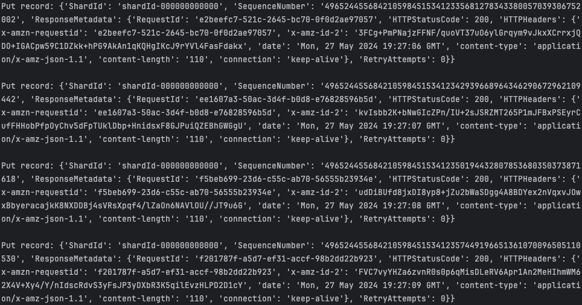
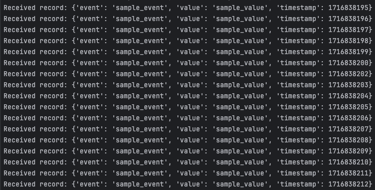

<h1>Kinesis Producer and Consumer Demo</h1>

<h2>Table of Contents</h2>
<ul>
    <li><a href="#overview">Overview</a></li>
    <li><a href="#about-aws-kinesis-data-streams">About AWS Kinesis Data Streams</a></li>
    <li><a href="#instructions">Instructions</a>
        <ul>
            <li><a href="#setup-virtual-environment">Setup virtual environment</a></li>
            <li><a href="#export-aws-access-key-and-secret-key-to-environment-variables">Export AWS Access Key and Secret Key to environment variables</a></li>
            <li><a href="#create-the-kinesis-data-stream-with-the-stream-manager-script">Create the Kinesis Data Stream with the Stream Manager Script</a></li>
            <li><a href="#run-the-stream-producer">Run the stream producer</a></li>
            <li><a href="#run-the-stream-consumer">Run the stream consumer</a></li>
        </ul>
    </li>
    <li><a href="#cleanup">Cleanup</a>
        <ul>
            <li><a href="#delete-the-kinesis-data-stream-with-the-stream-manager-script">Delete the Kinesis Data Stream with the Stream Manager Script</a></li>
        </ul>
    </li>
</ul>

<h2>Overview:</h2>

This is a demo to programmatically manage a Kinesis Data Stream in AWS, with a stream producer and consumer.
The data being sent with the producer can be modified to send different payloads, and the consumer logic
can be modified to process the incoming payload in different manners.

<h2>About AWS Kinesis Data Streams:</h2>

AWS Kinesis Data Streams is a scalable real-time data streaming service designed to handle streams of data per second, enabling real-time data processing and analytics. It allows applications to continuously ingest and process large amounts of streaming data, such as log and event data, from various sources.

<h2>Instructions:</h2>

Getting the Data Stream up and running requires a few steps outlined below.

<h3 id="setup-virtual-environment">
Setup virtual environment
</h3>
<pre><code class="language-bash">
python3 -m venv venv;
pip install -r requirements.txt;
</code></pre>

<h3 id="export-aws-access-key-and-secret-key-to-environment-variables">
Export AWS Access Key and Secret Key to environment variables
</h3>
<pre><code class="language-bash">
export AWS_ACCESS_KEY_ID="{ACCESS_KEY_ID_STRING}";
export AWS_SECRET_ACCESS_KEY="{AWS_SECRET_ACCESS_KEY_STRING}";
</code></pre>

<h3 id="create-the-kinesis-data-stream-with-the-stream-manager-script">
Create the Kinesis Data Stream with the Stream Manager Script
</h3>

Note: The 'create' keyword after the script is needed. Creating this Data Stream will incur AWS charges

<pre><code class="language-bash">
python3 kinesis_stream_manager.py create;
</code></pre>

<h3 id="run-the-stream-producer">
Run the stream producer
</h3>
<pre><code class="language-bash">
python3 producer.py;
</code></pre>

Once the stream producer is running, you should see logs of the data being produced to the stream:

<h3 id="run-the-stream-consumer">
Run the stream consumer
</h3>
<pre><code class="language-bash">
python3 consumer.py;
</code></pre>

Once the stream consumer is running, you should see logs of the data being consumed from the stream:

<h2>Cleanup:</h2>

Once you are done with the Kinesis Data Stream, you should delete the instance to stop incurring further charges.

<h3 id="delete-the-kinesis-data-stream-with-the-stream-manager-script">
Delete the Kinesis Data Stream with the Stream Manager Script
</h3>

Note: The 'delete' keyword after the script is needed. The CloudFormation stack will be deleted as well as the Kinesis Stream defined by it.

<pre><code class="language-bash">
python3 kinesis_stream_manager.py delete;
</code></pre>

